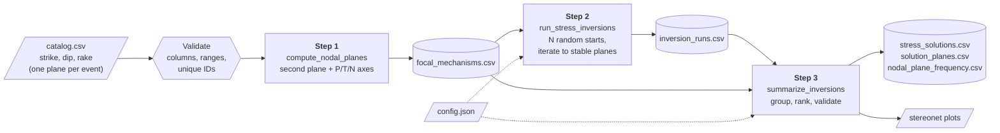
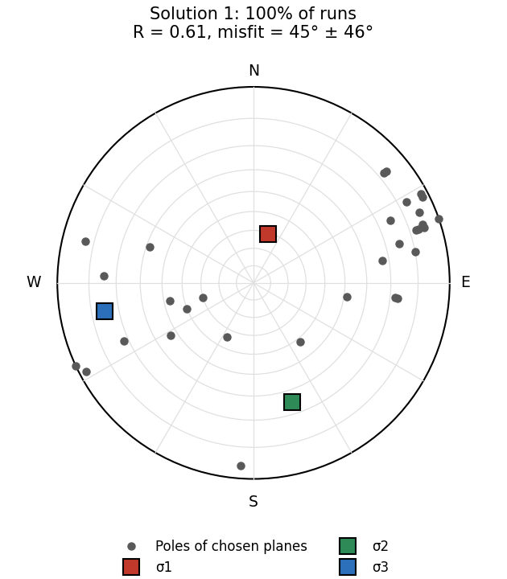
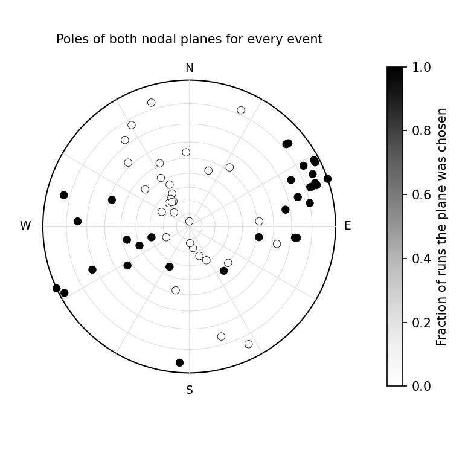

# Focal Mechanism Stress Inversion


**Estimate the stress state in the crust from earthquake focal mechanisms, even when you don't know which of the two nodal planes actually slipped.**

This is a three-step data pipeline, available in both **Python** and **MATLAB**. It takes a plain CSV catalog of earthquakes and returns:

- the most likely stress directions and stress ratio
- which nodal plane most likely slipped for each event
- a statistical check of whether one stress state explains all the data

I originally wrote this code at UW–Madison to estimate the stress in a geothermal reservoir for the DOE-funded WHOLESCALE project ([Jahnke et al., 2023, *Geothermics*](https://www.sciencedirect.com/science/article/pii/S0375650523000378)). This repository rebuilds that research code as a general, tested, documented tool that works on any catalog.

---

## The problem

Every focal mechanism gives two possible fault planes that fit the seismic data equally well. Only one of them slipped. Stress inversions need the real fault plane, and without extra information (such as mapped faults or aftershock alignments) there is no way to tell which one it is.

This pipeline uses the whole catalog to decide. It follows the iterative approach of [Vavryčuk (2014)](https://doi.org/10.1093/gji/ggu224):

1. Guess a plane for every event.
2. Invert those planes for stress.
3. Under that stress, check which of each event's two planes is closer to failure.
4. Switch to those planes and repeat until the choice stops changing.

The answer can depend on the first guess, so this is repeated from hundreds or thousands of random starts and the results are tallied.

## Pipeline



Each step reads and writes plain CSV files, so you can run any step on its own, inspect its output, or swap in your own data at any point. For example, if your catalog already has both nodal planes you can skip straight to step 2.

| Step | Function (Python and MATLAB) | Input | Output |
|---|---|---|---|
| 1. Nodal planes | `compute_nodal_planes` | catalog CSV | `focal_mechanisms.csv` |
| 2. Stress inversions | `run_stress_inversions` | `focal_mechanisms.csv` | `inversion_runs.csv` |
| 3. Summarize and validate | `summarize_inversions` | both of the above | `stress_solutions.csv`, `solution_planes.csv`, `nodal_plane_frequency.csv`, plots |

## Quick start

### Python (3.9+)

```bash
git clone https://github.com/bjjahnke/focal-mechanism-stress-inversion.git
cd focal-mechanism-stress-inversion
pip install -e .

focal-stress run examples/san_emidio_2016/config.json
```

Run one step at a time:

```bash
focal-stress nodal-planes my_catalog.csv out/focal_mechanisms.csv
focal-stress invert out/focal_mechanisms.csv out/inversion_runs.csv --n-runs 2000 --seed 1
focal-stress summarize out/focal_mechanisms.csv out/inversion_runs.csv out/
```

Or use it as a library:

```python
from focal_stress import load_catalog, compute_nodal_planes, run_stress_inversions, summarize_inversions

mechanisms = compute_nodal_planes(load_catalog("my_catalog.csv"))
runs = run_stress_inversions(mechanisms, friction=0.6, n_runs=1000, random_seed=42)
summary = summarize_inversions(mechanisms, runs)
print(summary.stress_solutions.head())
```

### MATLAB (R2019b or newer, no toolboxes needed)

```matlab
addpath('matlab')
run_pipeline('examples/san_emidio_2016/config.json')

% or one step at a time
M       = compute_nodal_planes('my_catalog.csv');
runs    = run_stress_inversions(M, 'NumRuns', 1000, 'RandomSeed', 42);
summary = summarize_inversions(M, runs);
```

## Inputs

**All you need is a CSV with `strike`, `dip` and `rake` for one nodal plane per earthquake.** Either plane works.

| Column | Required? | Notes |
|---|---|---|
| `strike` | **Required** | degrees, 0–360, right-hand rule |
| `dip` | **Required** | degrees, 0–90 |
| `rake` | **Required** | degrees, −180 to 180 (Aki & Richards) |
| `event_id` | Optional | unique ID; generated if missing |
| `uncertainty_deg` | Optional | fault-plane uncertainty per event; turns on the variance test in step 3 |
| anything else | Optional | passed through untouched (time, location, magnitude, …) |

Settings go in a small JSON config. Only the two paths are required:

```json
{
  "input_catalog": "catalog.csv",
  "output_dir": "output",
  "friction": 0.6,
  "n_runs": 1000,
  "max_iterations": 20,
  "random_seed": 42,
  "significance_level": 0.05,
  "make_plots": true
}
```

## Outputs

| File | One row per | What it tells you |
|---|---|---|
| `focal_mechanisms.csv` | event | both nodal planes and the P, T, N axes |
| `inversion_runs.csv` | run | where each random start ended up, and whether it converged |
| `stress_solutions.csv` | distinct answer | stress directions, stress ratio, fit, how often it was reached, and the variance test |
| `solution_planes.csv` | solution × event | which plane slipped, its misfit and how close it is to failure |
| `nodal_plane_frequency.csv` | event × plane | how often each plane was chosen across all runs |
| `run_metadata.json` | pipeline run | settings, software versions, run time, files written |
| `plots/*.png` | — | stereonets of the solutions and plane frequencies |

**[Full column-by-column definitions are in `docs/data_dictionary.md`.](docs/data_dictionary.md)**

## Example: San Emidio geothermal field, 2016

`examples/san_emidio_2016/` holds the 31 microearthquake focal mechanisms recorded while the San Emidio geothermal power plant (Nevada) was shut down in December 2016. These are the data used in Jahnke et al. (2023).

<p align="center">
  
  
</p>

| Result | Value |
|---|---|
| Runs reaching the same answer | 1,000 of 1,000 |
| σ1 (most compressive) | near-vertical (trend 017°, plunge 61°) |
| σ2 | north-northwest to south-southeast, near-horizontal (162°/25°) |
| σ3 (least compressive) | east–west, near-horizontal (259°/15°) |
| Stress ratio R | 0.61 |
| Mean misfit | 45° ± 46° |
| Variance test | passes (p = 0.70): one stress state explains the data within their uncertainty |

**Interpretation:** a normal-faulting stress regime with the least compressive stress oriented east–west, which favors slip on faults striking roughly north–south. In the paper, this result constrained the initial stress model used to evaluate slip tendency on the reservoir's faults, which in turn informs well placement, stimulation design and induced-seismicity risk.

Notes on the example data:

- The focal mechanisms were computed with HASH by Hao Guo (UW–Madison).
- `uncertainty_deg` is approximated from the HASH quality grade (A = 25°, B = 35°, C = 45°, the upper bound of each grade's RMS fault-plane uncertainty), not the per-event values used in the paper.
- `depth_km` is relative to sea level; negative values are above sea level.

### Synthetic check

`examples/synthetic/` generates 40 events from a **known** stress state with 10° of noise added to rake (`python examples/synthetic/make_catalog.py`). The pipeline recovers σ1 within 3° and picks the true fault plane for 39 of 40 events, without being told which plane is which.

## Validation and testing

- **Python:** 15 `pytest` tests (`pytest -q`). They cover geometry round-trips, catalog validation, recovery of a known stress state, reproducibility with a seed, and a regression check against the original research code.
- **MATLAB:** `matlab/tests/run_tests.m`, 7 checks covering the same ground.
- **The two languages agree.** On the same inputs, Python and MATLAB write identical output files, including runs that cycle and results with more than one stress solution.
- **CI:** both test suites run on every push through GitHub Actions.

## How this differs from the original research code

The original was a pair of MATLAB scripts tied to one dataset. This version:

| Original | Now |
|---|---|
| Hard-coded file paths and dataset | Any CSV catalog, set in a config file |
| `.mat` files passed between scripts | Plain CSV outputs with a documented schema |
| No input checks | Validation with row-level error messages |
| Fixed 10 iterations per run | Stops when the plane choice settles; detects and reports runs that cycle |
| Stress solutions de-duplicated one column at a time, which could mismatch rows | Solutions grouped by their full set of planes, so every row is internally consistent |
| Needed the Statistics Toolbox | No toolboxes |
| MATLAB only | Python and MATLAB, with the same outputs |
| No tests | Unit tests, a known-answer synthetic test and CI |

It also fixes a sign error in the original second-plane calculation: for 5 of the 31 example events, the plane-2 rake pointed the wrong way, so plane 2's P and T axes didn't match plane 1's. The new code is checked by requiring both planes to give identical P and T axes.

## Repository layout

```
├── python/focal_stress/       Python package
│   ├── catalog.py             load and validate input
│   ├── geometry.py            plane / vector / trend-plunge conversions
│   ├── nodal_planes.py        step 1
│   ├── linear_inversion.py    single stress inversion (Michael, 1984)
│   ├── iterative_inversion.py step 2
│   ├── summarize.py           step 3
│   ├── plots.py               stereonets
│   ├── pipeline.py, cli.py    config-driven runner and command line
│   └── synthetic.py           known-answer test data
├── python/tests/
├── matlab/                    same functions, same names, same outputs
│   ├── private/               helpers
│   └── tests/run_tests.m
├── examples/
│   ├── san_emidio_2016/       real catalog + config
│   └── synthetic/             generated catalog with a known answer
└── docs/data_dictionary.md    every input and output column
```

## Method references

- Michael, A. J. (1984). Determination of stress from slip data: faults and folds. *Journal of Geophysical Research*, 89(B13), 11517–11526.
- Vavryčuk, V. (2014). Iterative joint inversion for stress and fault orientations from focal mechanisms. *Geophysical Journal International*, 199(1), 69–77.
- Aki, K., & Richards, P. G. (2002). *Quantitative Seismology* (2nd ed.). University Science Books.

## Citation

If you use this code, please cite:

> Jahnke, B., Sone, H., Guo, H., Sherman, C., Warren, I., Kreemer, C., Thurber, C. H., Feigl, K. L., & the WHOLESCALE Team (2023). Geomechanical analysis of the geothermal reservoir at San Emidio, Nevada. *Geothermics*, 110, 102683. https://doi.org/10.1016/j.geothermics.2023.102683

## Acknowledgments

The linear inversion follows the MATLAB implementation of Michael's method written by Hiroki Sone (UW–Madison). The example focal mechanisms are from Hao Guo. The original work was part of the WHOLESCALE project, funded by the U.S. Department of Energy.

## License

MIT. See [LICENSE](LICENSE).
